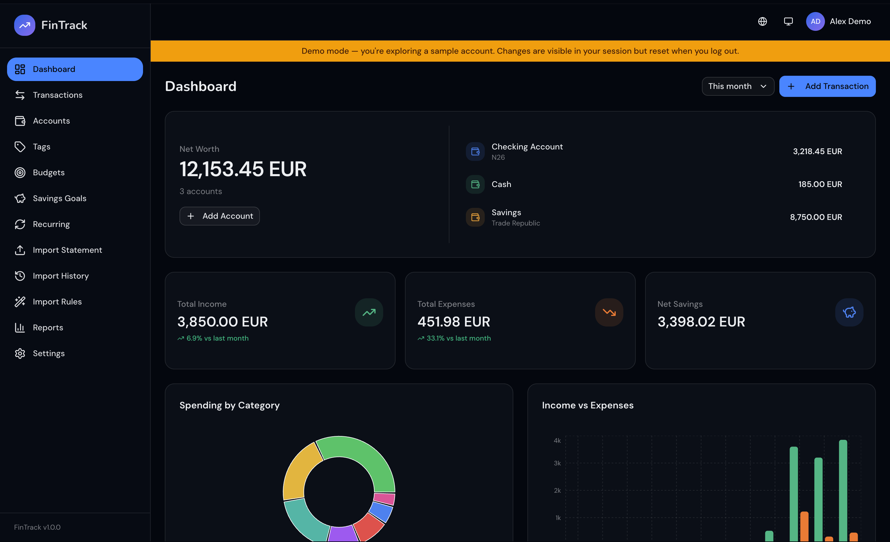
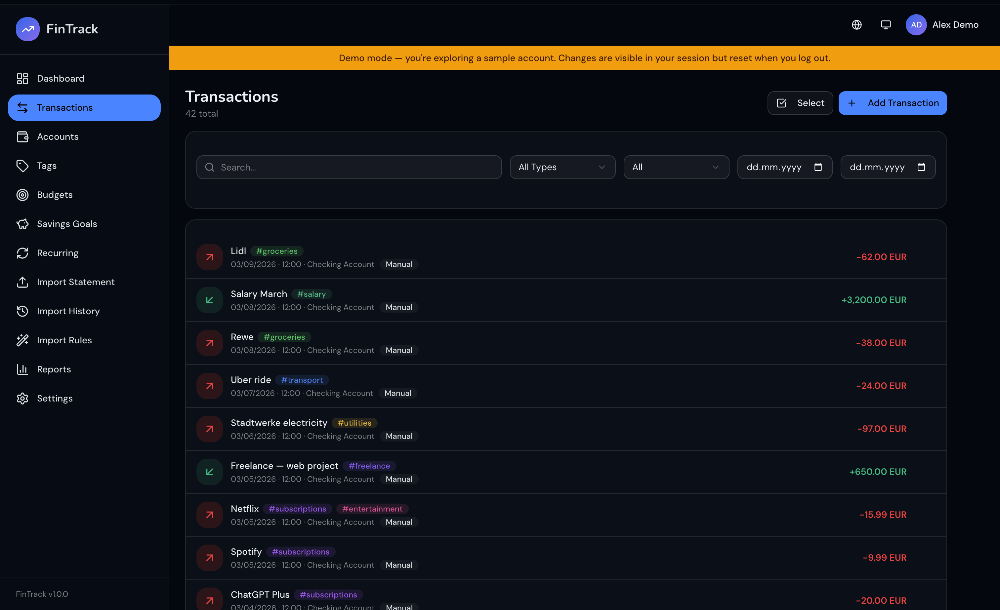

# FinTrack

I began this because I was tired of manually copying card transactions into a spreadsheet. It worked, but it was slow and I kept falling behind on it.

The first idea was just to pull transactions automatically from bank statement exports instead of writing them by hand. But once I had that working I figured it made more sense to have everything in one place, cash, card, savings, all of it, rather than a spreadsheet that only tracked one thing.

The intention was to build something I would use myself, but also something that could help others who want a cleaner way to track their personal finances.



---

## Features

**Core**
- Dashboard — balances, income vs expenses, spending by category, recent transactions
- Transactions — full history with filtering by type, account, date range, tags and search
- Bank accounts — multiple accounts (cash, card, savings, investment, loan)
- Budgets — monthly/weekly/yearly with alert thresholds, rollover and sharing
- Savings goals — track progress with deposit flow
- Recurring transactions — rules for repeating income/expenses, auto-processed on login

**Importing**
- Bank statement import — CSV exports from Revolut, N26, Wise, ING, BCR, Banca Transilvania or generic CSV
- Import rules — auto-tag transactions based on description patterns
- Import history — full log with stats



**Other**
- Reports — custom date range, trend charts, CSV/JSON export
- Demo mode — ephemeral account cloned from template, reset on logout
- English and Romanian
- Dark/light/system theme

---

## Tech Stack

| Layer | Tech |
|-------|------|
| Framework | Next.js 16 (App Router) |
| Language | TypeScript |
| Database | PostgreSQL (Neon) |
| ORM | Prisma |
| Auth | iron-session |
| UI | shadcn/ui + Tailwind CSS v4 |
| Charts | Recharts |
| Data fetching | TanStack Query |
| CSV parsing | PapaParse |
| i18n | next-intl |
| Deployment | DigitalOcean App Platform |

---

## Running Locally

**Prerequisites:** Node.js 20+, PostgreSQL database

```bash
git clone https://github.com/mateivul/fintrack
cd fintrack
npm install
```

Create a `.env` file:

```env
DATABASE_URL="postgresql://..."
SESSION_SECRET="..."
```

Set up the database:

```bash
npx prisma db push
npm run db:seed
```

Start the dev server:

```bash
npm run dev
```

Open [http://localhost:3000](http://localhost:3000).
